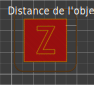

# skirt_distance

* Technologie : FDM
* Groupe : [Réglages de l'Impression](../print_settings/print_settings.md)
* Sous groupe : [Jupe et Bordure](../print_settings/print_settings.md#jupe-et-bordure) - Jupe
* Mode : Avancé

## Distance de l'objet

### Description

Distance entre le ou les objet(s) et la jupe. 

Mettez zéro pour attacher la jupe à l'(aux) objet(s) et obtenir une bordure pour une meilleure adhésion.

* Valeur par défaut : 6mm

[Retour Liste variables](variable_list.md)
