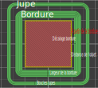

# skirt_distance_from_brim

* Technologie : FDM
* Groupe : [Réglages de l'Impression](../print_settings/print_settings.md)
* Sous groupe : [Jupe et Bordure](../print_settings/print_settings.md#jupe-et-bordure) - Jupe
* Mode : Avancé

## A partir de la bordure

### Description

La distance est calculé à partir de la bordure. Sinon la distance sera calculé à partir de l'objet.

[Retour Liste variables](variable_list.md)