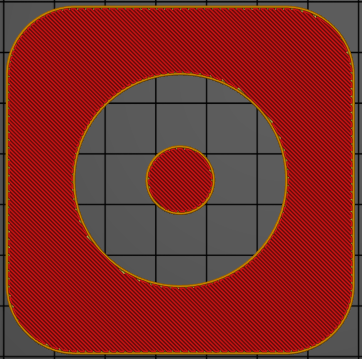
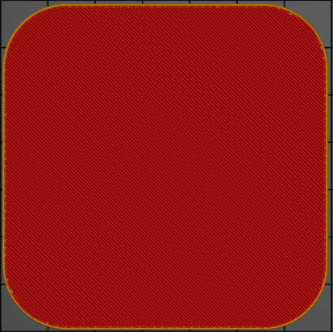

# slicing_mode

* Technologie : FDM 
* Groupe : [Réglages de l'Impression](../print_settings/print_settings.md)
* Sous groupe : [Couche](../print_settings/print_settings.md#couche) - [Autre](../print_settings/print_settings.md#autre)
* Mode : Avancé
* Version : 2.4.X

## Mode de découpage

### Description

Utiliser "Pair-impair" pour les modèles d'avions 3DLabPrint. Voir la page [3DLabPrint](https://3dlabprint.com/faq/prusaslicer/). 

On peut voir avec le mode ordinaire que les structures internes ne sont pas correctement créées.

On peut voir avec le mode Pair/Impair activé que les structures internes sont correctement créées.

Utiliser "Fermer les trous" pour fermer tous les trous du modèle. Cette option va supprimer tous les trous se trouvant dans un modèle.

[Retour Liste variables](variable_list.md)
