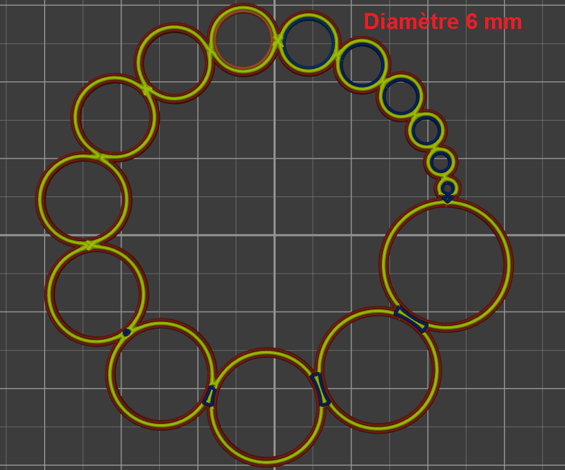

# small_perimeter_speed

* Technologie : FDM
* Groupe : [Réglages de l'Impression](../print_settings/print_settings.md)
* Sous groupe : [Vitesse](../print_settings/print_settings.md#vitesse) - Vitesses pour les déplacements d'impression
* Mode : Avancé

## Vitesse pour petits périmètres

### Description

Ce réglage distinct affectera la vitesse des petites périmètres qui sont définis pas les réglages [small_perimeter_min_length](small_perimeter_min_length.md) et [small_perimeter_max_length](small_perimeter_max_length.md) .
Si cette valeur est exprimée en pourcentage (par exemple: 80%) elle sera calculée d'après le réglage de la [vitesse de périmètre](perimeter_speed.md) susmentionnée.

> Réglez sur zéro pour un ajustement automatique.

* Valeur par défaut : 15 mm/s

Réglage avec [longueur mini](small_perimeter_min_length.md) = 21 mm  et [longueur maxi](small_perimeter_max_length.md) =24 mm.  Pour avoir une réduction de vitesse sur un diamètre 6 comme sur l'image la valeur à renseigner pour la longueur mini est de (6 + largeur extrusion) x pi  => 6.45 x pi = 20.26 . On utilisera donc 21 pour arrondir à la valeur supérieure.

[Retour Liste variables](variable_list.md)