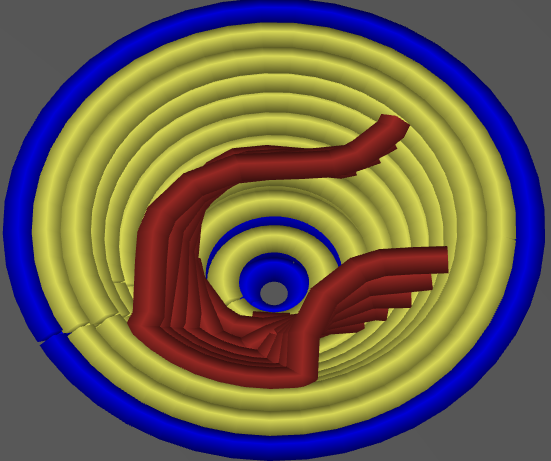
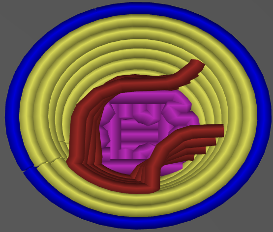

# solid_over_perimeters

* Technologie : FDM
* Groupe : [Réglages de l'Impression](../print_settings/print_settings.md)
* Sous groupe : [Périmètre et enveloppe](../print_settings/print_settings.md#périmètre-et-enveloppe)  - Coques horizontales
* Mode : Avancé
* Version : 2.3.57.2

## Pas de remplissage plein si plus de

### Description

Lorsque vous avez un nombre de couches pleines inférieures, et un nombre faible ou moyen de périmètres, alors il faut mettre du remplissage plein à l'intérieur de la pièce pour avoir assez de couches solides.

En fixant cette valeur à un niveau supérieur à 0, vous pouvez supprimer ce 'remplissage intérieur'. 

Ce nombre permet d'en garder si le nombre de périmètre au-dessus du vide est faible.

Exemple avec une section dans le vide et un réglage des paramètres à 3 Périmètres et 3 Couches inférieures.

Remplissage normal si l'option est désactivée, A noter que l'option [S'assurer de l'épaisseur de la coque verticale](ensure_vertical_shell_thickness.md) ne sera plus respecté si l'option est active : 

Plus de 1, toutes les couches de remplissages sont désactivées :

 

Les contours en gris supérieures sont les controu rajouter pour [s'assurer de l'épaisseur de la coque verticale](ensure_vertical_shell_thickness.md).

Plus de 2, reste les 2 premières couches de remplissage :

 

Plus de 3, reste les 3 premières couches de remplissage :

Si ce paramètre est égal ou supérieur au nombre de couches pleines supérieures et inférieures, il n'enlévera rien.

Si ce paramètre est réglé sur 1, il enlévera toutes les couches pleines qui sont seulement au-dessus des périmètres.

Mettez à zéro pour le désactiver.

[Retour Liste variables](variable_list.md)
