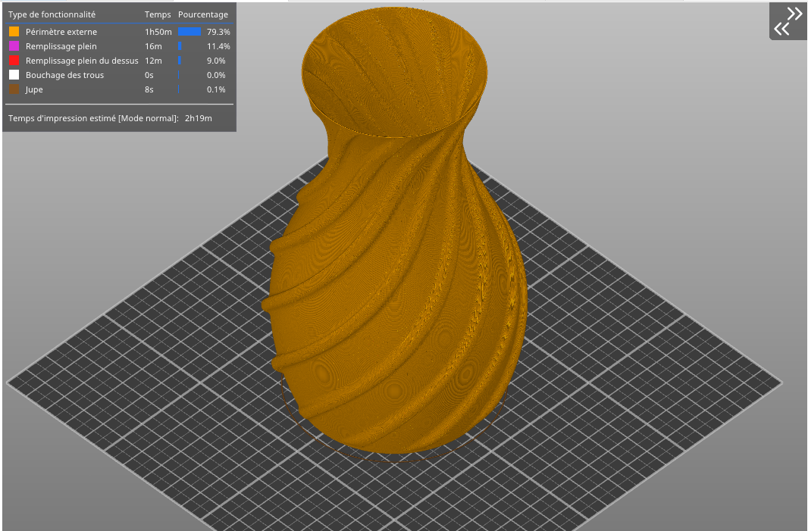
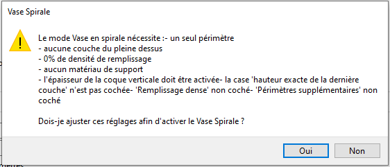

# spiral_vase

* Technologie : FDM
* Groupe : [Réglages de l'Impression](../print_settings/print_settings.md)
* Sous groupe : [Périmètre et enveloppe](../print_settings/print_settings.md#périmètre-et-enveloppe) - PArois verticales
* Mode : Simple

## Vase spirale

### Description

Cette fonction va élever Z progressivement au cours de l'impression d'un objet à paroi unique afin de supprimer toute jonction visible. Cette option requiert un périmètre unique, aucun remplissage, aucune couche pleine du dessus et aucun matériau de support. Vous pouvez toujours paramétrer le nombre de couches pleines du dessous que vous souhaitez de même que des boucles de jupe/bordure. 

Pièce découpée en mode Vase Spirale : 

Attention cette fonction ne fonctionnera pas si vous imprimez plus d'un objet.

Message erreur associé à l'activation du mode vase :

[Retour Liste variables](variable_list.md)
