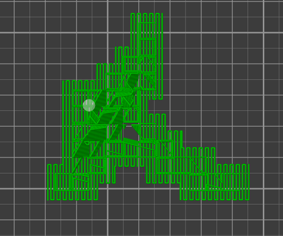
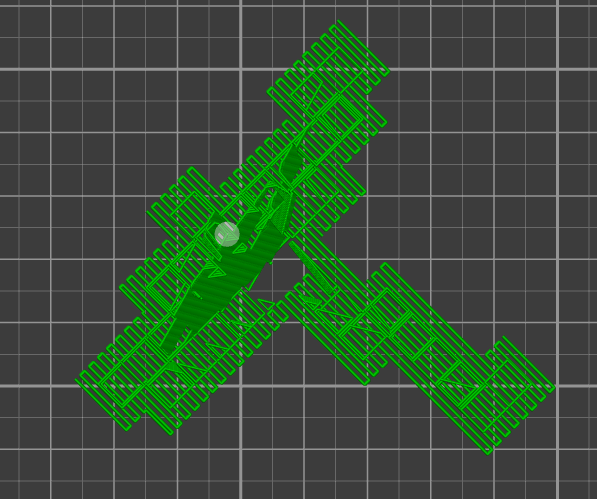

# support_material_angle

* Technologie : FDM
* Groupe : [Réglages de l'Impression](../print_settings/print_settings.md)
* Sous groupe : [Support](../print_settings/print_settings.md#support) - [Option pour le réglage des supports](../print_settings/print_settings.md#option-pour-le-réglage-des-supports)
* Mode : Expert

## Angle des motifs pour supports

### Description

Utiliser ce réglage pour orienter le motif du support. Exemple avec une réglage à 0° pour l'angle des motifs des supports.

La même pièce cette fois à 45° :

Valide si l'option [support_material](support_material.md) est active

[Retour Liste variables](variable_list.md)
