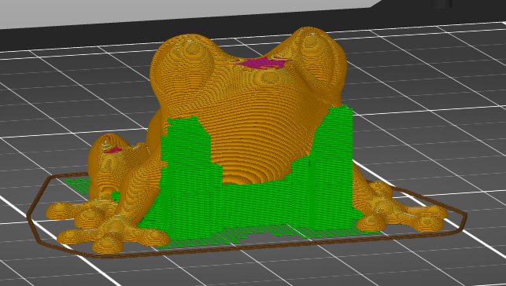

# support_material_auto

* Technologie : FDM
* Groupe : Réglages de l'Impression
* Sous groupe : Support 
* Mode : Simple

## Supports générés automatiquement

### Description

Activer la génération des supports.

Les imprimantes 3D avec fabrication de filaments fondus fonctionnent en plaçant un cordon de plastique fondu aux bons endroits. Si ce plastique n'est pas soutenu, il va s'affaisser, car il est poussé hors de la buse avec une force importante et à cause de la gravité. À moins que le modèle ne se trouve en dessous pour soutenir la nouvelle couche, il devra être soutenu par une structure de support supplémentaire, qui sera enlevée et jetée après l'impression du modèle.

Ce réglage permet de créer des structures de support pour soutenir l'objet pendant l'impression. 

L'impression d'un support prend beaucoup de temps et de matière. Lorsque le support touche le modèle, il doit être enlevé plus tard, une fois l'impression terminée. Cela a tendance à laisser une cicatrice sur la surface.

Cependant, le support est parfois complètement nécessaire. Par exemple, si le modèle comporte un morceau qui pointe vers le bas en direction de la plaque de construction, ce morceau serait sinon simplement suspendu en l'air.

#### Conception pour empêcher le support

Bien que cela soit parfois nécessaire, il convient d'éviter autant que possible les supports d'impression. Il existe de nombreuses techniques pour éviter d'avoir à imprimer un support. Il s'agit d'une grande partie de la conception des modèles pour l'impression en 3D. Voici quelques techniques permettant de modifier votre modèle 3D pour éviter d'avoir besoin d'un support.
* Orientez votre modèle de manière à ce qu'il n'y ait pas de surfaces planes plus hautes que la plaque de construction.
* Évitez autant que possible de concevoir des surplombs.
* Les plus grands surplombs peuvent être franchis s'ils sont soutenus des deux côtés. SuperSlicer orientera automatiquement les lignes du côté inférieur de ce surplomb de manière à ce qu'elles passent en ligne droite au-dessus du pont. Pendant l'impression de ces lignes, la buse maintiendra la tension sur le bourrelet de manière à ce qu'il ne s'affaisse pas. Cela lui donne ensuite suffisamment de temps pour se solidifier afin qu'il puisse tenir tout seul.
* S'il y a un vide dans le surplomb, un pont sacrificiel peut être conçu. Il s'agit d'une couche dans laquelle la brèche est fermée. Cela permet de construire un bon pont, de sorte que la deuxième couche peut construire les parois appropriées de l'espace sur le dessus. Après l'impression, la fente peut être ouverte avec un couteau, puisqu'elle n'a qu'une seule couche d'épaisseur.

[Retour Liste variables](variable_list.md)