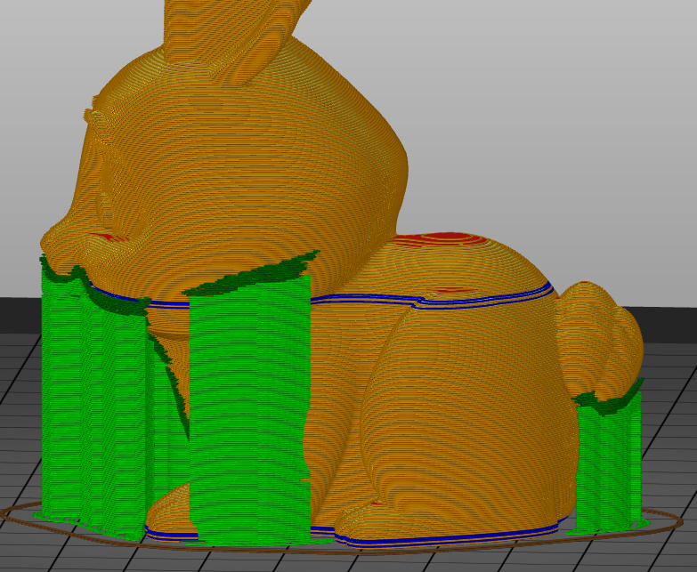
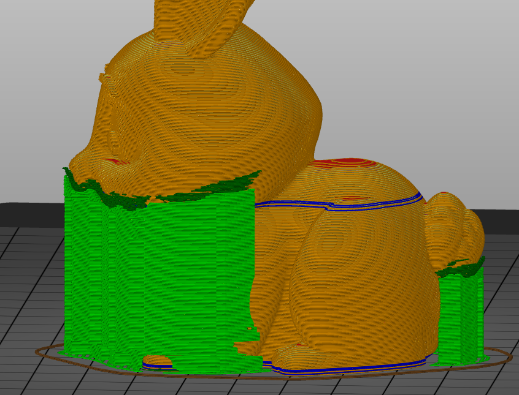

# support_material_closing_radius

* Technologie : FDM
* Groupe : [Réglages de l'Impression](../print_settings/print_settings.md)
* Sous groupe : [Support](../print_settings/print_settings.md#support) - [Option pour le réglage des supports](../print_settings/print_settings.md#option-pour-le-réglage-des-supports)
* Mode : Avancé
* Version : 2.4.X

## Rayon de fermeture

### Description

Pour des supports bien ajustés, les régions de support seront fusionnées à l'aide d'une opération de fermeture morphologique. 
Les espaces plus petits que le rayon de fermeture seront comblés.

Ce paramètres permet de filtrer les petites zones de supports en les raccordant à une zone plus importante ou si elles sont trop éloignées d'une zone principale en les supprimant.

Ce paramètre permet de réaliser une filtration des petites zones qui pourraient conduire à une mauvaise qualité des impressions.

[Retour Liste variables](variable_list.md)