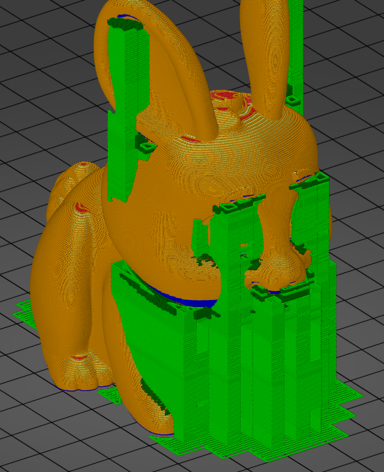
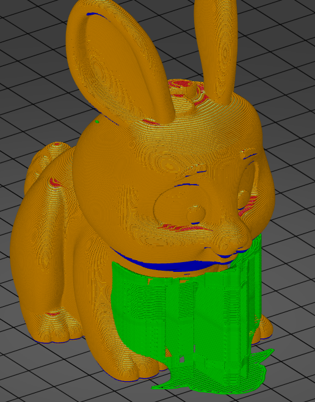

# support_material_style

* Technologie : FDM
* Groupe : [Réglages de l'Impression](../print_settings/print_settings.md)
* Sous groupe : [Support](../print_settings/print_settings.md#support) - Option pour l'interface des supports
* Mode : Avancé
* Version : 2.4.x

## Style

### Description

Style et forme des support. 

La création des supports dans une grille régulière créera des supports plus stables, 

Tandis que des supports bien ajustées économiseront du matériau et réduiront les marques sur les objets.

[Retour Liste variables](variable_list.md)