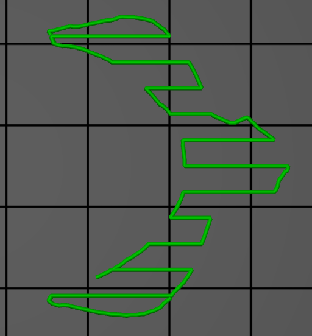
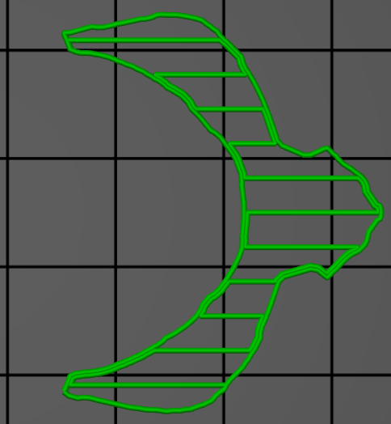

# support_material_with_sheath

* Technologie : FDM
* Groupe : [Réglages de l'Impression](../print_settings/print_settings.md)
* Sous groupe : [Support](../print_settings/print_settings.md#support) - [Option pour le réglage des supports](../print_settings/print_settings.md#option-pour-le-réglage-des-supports)
* Mode : Expert

## Avec une enveloppe autour du support

### Description

Ajouter une enveloppe (une ligne unique de périmètre) autour de la base du support.
Ceci rend le support plus fiable, mais aussi plus difficile à retirer.

[Retour Liste variables](variable_list.md)