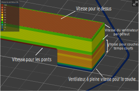

# top_fan_speed

* Technologie : FDM
* Groupe : [Réglages du Filament](../filament_settings/filament_settings.md)
* Sous groupe : [Refroidissement](../filament_settings/filament_settings.md#refroidissement) - Vitesse du ventilateur par défaut
* Mode : Avancé

## *Vitesse du ventilateur* pour le dessus

### Description

Cette vitesse de ventilation est appliquée pendant tous les remplissages du dessus.

> Réglez sur 1 pour désactiver le ventilateur.
> Mettez la valeur -1 pour utiliser la vitesse normale du ventilateur sur les couches du dessus.

Ne peut être remplacée que par [disable_fan_first_layers](disable_fan_first_layers.md).

[Retour Liste variables](variable_list.md)