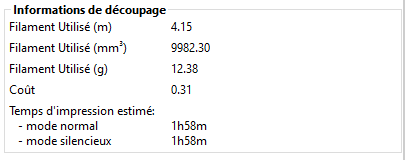

# Liste des variables

## Contenu de la page

* Liste des variables
    * [SuperSlicer liste des variables](#superslicer-liste-des-variables) 
    * [Variables les plus utiles](#variables-les-plus-utiles)
    * [Variables supplémentaires dans le Format du nom de fichier de sortie](#variables-supplémentaires-dans-le-format-du-nom-de-fichier-de-sortie) 
    * [Variables macro spéciales](#variables-macro-spéciales)
    * [Variables impression](#variables-impression)  

* [Retour Page principale](../superslicer.md)

## SuperSlicer liste des variables

Sur cette page, vous trouverez une liste de variables SuperSlicer qui peuvent être utilisées dans les paramètres personnalisés du G-Code

Vous pouvez utiliser plusieurs variables à la fois, par exemple :

	M109 T[next_extruder] S[first_layer_temperature[next_extruder]]

générerait quelque chose comme :

	M109 T1 S190

Notez que les valeurs de l'interface graphique SuperSlicer sont utilisées et non celles auxquelles votre firmware s'attend. Ceci est particulièrement valable par exemple pour les vitesses qui sont exprimées dans les interfaces des trancheuses en mm/s alors que dans les fichiers G-Code elles sont généralement définies en m/min.

### Variables les plus utiles

[bed_temperature](bed_temperature.md)

	M140 S[bed_temperature]

note : Il prendra toujours la valeur du filament chargé dans l'extrudeuse_0

[current_extruder](current_extruder.md)

	M104 S[first_layer_temperature[current_extruder]]

note : cela ne fonctionnera pas dans le G-Code de démarrage car l'espace [current_extruder] est rempli avec le numéro de la dernière extrudeuse utilisée, qui n'est pas encore défini au démarrage et est aléatoire pour les autres pièces qui pourraient être imprimées.

[first_layer_temperature](first_layer_temperature.md)

	M104 S[first_layer_temperature_0] M104 S[first_layer_temperature[next_extruder]]

[first_layer_bed_temperature](first_layer_bed_temperature.md)

	M140 S[first_layer_bed_temperature]

note : Il prendra toujours la valeur du filament chargé dans l'extrudeuse_0

[layer_num](layer_num.md)

	M117 printing layer [layer_num]

[layer_z](layer_z.md)

	M117 printing layer [layer_num] at [layer_z]mm

[total_layer_count](total_layer_count.md)

	M117 printing layer {layer_num+1}/[total_layer_count]

[next_extruder](next_extruder.md)

	M104 S[first_layer_temperature[next_extruder]]

note : cela ne fonctionne que dans le G-Code de changement d'outil

[previous_extruder](previous_extruder.md)

	M104 S[first_layer_temperature[previous_extruder]]

note : cela ne fonctionne que dans le G-Code de changement d'outil

[temperature](temperature.md)

	M109 S[temperature_0] M109 S[temperature[previous_extruder]]

[extrusion_role](extrusion_role.md)

### Variables supplémentaires dans le Format du nom de fichier de sortie

* [print_time](print_time.md)
* [normal_print_time](normal_print_time.md)
* [silent_print_time](silent_print_time.md)
* [used_filament](used_filament.md)
* [extruded_volume](extruded_volume.md)
* [total_cost](total_cost.md)
* [total_weight](total_weight.md)
* [total_wipe_tower_cost](total_wipe_tower_cost.md)
* [total_wipe_tower_filament](total_wipe_tower_filament.md)

## Variables macro spéciales

    bounding_box (tableau de 3 valeurs)
    current_extruder
    current_object_idx
    year
    month
    day
    hour
    minute
    second
    timestamp
    filament_preset
    first_layer_print_convex_hull
    first_layer_print_max
    first_layer_print_min
    first_layer_print_size
    has_single_extruder_multi_material_priming
    has_wipe_tower
    initial_extruder
    initial_tool
    input_filename
    input_filename_base
    physical_printer_preset
    print_bed_max
    print_bed_min
    print_bed_size
    print_preset
    printer_preset
    scale
    total_layer_count
    total_toolchanges
    version

### Variables impression

* [printer_technology](printer_technology.md)
* [bed_shape](bed_shape.md)
* [bed_custom_texture](bed_custom_texture.md)
* [bed_custom_model](bed_custom_model.md)
* [bed_texture](bed_texture.md)
* [bed_model](bed_model.md)

* [thumbnails](thumbnails.md)
* [thumbnails_color](thumbnails_color.md)
* [thumbnails_color_int](thumbnails_color_int.md)
* [thumbnails_custom_color](thumbnails_custom_color.md)
* [thumbnails_with_bed](thumbnails_with_bed.md)
* [thumbnails_with_support](thumbnails_with_support.md)

* [layer_height](layer_height.md)
* [initial_layer_height](initial_layer_height.md)
* [max_print_height](max_print_height.md)
* [preset_name](preset_name.md)

* [print_host](print_host.md)
* [printhost_apikey](printhost_apikey.md)
* [printhost_port](printhost_port.md)
* [printhost_cafile](printhost_cafile.md)
* [printhost_user](printhost_user.md)
* [printhost_password](printhost_password.md)
* [printhost_authorization_type](printhost_authorization_type.md)

* [allow_empty_layers](allow_empty_layers.md)

* [bed_temperature](bed_temperature.md)

* [before_layer_gcode](before_layer_gcode.md)

* [between_objects_gcode](between_objects_gcode.md)

* [bottom_solid_layers](bottom_solid_layers.md)
* [bottom_solid_min_thickness](bottom_solid_min_thickness.md)

* [bridge_acceleration](bridge_acceleration.md)
* [bridge_angle](bridge_angle.md)
* [bridge_fan_speed](bridge_fan_speed.md)

	`M106 S[bridge_fan_speed]`

Il s'agit de la valeur réelle (0-100) qui a été saisie, et non de 0-255 .

* [top_fan_speed](top_fan_speed.md)
* [bridge_flow_ratio](bridge_flow_ratio.md)
* [over_bridge_flow_ratio](over_bridge_flow_ratio.md)
* [bridge_overlap](bridge_overlap.md)
* [bridge_speed](bridge_speed.md)
* [bridge_speed_internal](bridge_speed_internal.md)
* [brim_inside_holes](brim_inside_holes.md)
* [brim_width](brim_width.md)
* [brim_width_interior](brim_width_interior.md)
* [brim_ears](brim_ears.md)
* [brim_ears_max_angle](brim_ears_max_angle.md)
* [brim_ears_pattern](brim_ears_pattern.md)
* [brim_offset](brim_offset.md)
* [chamber_temperature](chamber_temperature.md)
* [clip_multipart_objects](clip_multipart_objects.md)
* [colorprint_heights](colorprint_heights.md)
* [compatible_printers](compatible_printers.md)
* [compatible_printers_condition](compatible_printers_condition.md)
* [compatible_prints](compatible_prints.md)
* [compatible_prints_condition](compatible_prints_condition.md)
* [compatible_printers_condition_cummulative](compatible_printers_condition_cummulative.md)
* [compatible_prints_condition_cummulative](compatible_prints_condition_cummulative.md)
* [complete_objects](complete_objects.md)
* [complete_objects_one_skirt](complete_objects_one_skirt.md)
* [complete_objects_sort](complete_objects_sort.md)
* [cooling](cooling.md)
* [cooling_tube_retraction](cooling_tube_retraction.md)
* [cooling_tube_length](cooling_tube_length.md)
* [default_acceleration](default_acceleration.md)
* [default_filament_profile](default_filament_profile.md)
* [default_print_profile](default_print_profile.md)
* [disable_fan_first_layers](disable_fan_first_layers.md)
* [duplicate_distance](duplicate_distance.md)
* [end_gcode](end_gcode.md)
* [end_filament_gcode](end_filament_gcode.md)
* [ensure_vertical_shell_thickness](ensure_vertical_shell_thickness.md)
* [top_fill_pattern](top_fill_pattern.md)
* [bottom_fill_pattern](bottom_fill_pattern.md)
* [solid_fill_pattern](solid_fill_pattern.md)
* [enforce_full_fill_volume](enforce_full_fill_volume.md)
* [external_infill_margin](external_infill_margin.md)
* [bridged_infill_margin](bridged_infill_margin.md)
* [external_perimeter_extrusion_width](external_perimeter_extrusion_width.md)
* [external_perimeter_cut_corners](external_perimeter_cut_corners.md)
* [external_perimeter_fan_speed](external_perimeter_fan_speed.md)
* [external_perimeter_overlap](external_perimeter_overlap.md)
* [perimeter_overlap](perimeter_overlap.md)
* [perimeter_bonding](perimeter_bonding.md)
* [external_perimeter_speed](external_perimeter_speed.md)
* [external_perimeters_first](external_perimeters_first.md)
* [external_perimeters_vase](external_perimeters_vase.md)
* [external_perimeters_nothole](external_perimeters_nothole.md)
* [external_perimeters_hole](external_perimeters_hole.md)
* [perimeter_loop](perimeter_loop.md)
* [perimeter_loop_seam](perimeter_loop_seam.md)
* [extra_perimeters](extra_perimeters.md)

### Périmètre et enveloppe

#### Qualité

* [only_one_perimeter_top](only_one_perimeter_top.md)
* [min_width_top_surface](min_width_top_surface.md)
* [extra_perimeters_overhangs](extra_perimeters_overhangs.md)
* [extra_perimeters_odd_layers](extra_perimeters_odd_layers.md)
* [avoid_crossing_perimeters](avoid_crossing_perimeters.md)
* [avoid_crossing_not_first_layer](avoid_crossing_not_first_layer.md)
* [avoid_crossing_perimeters_max_detour](avoid_crossing_perimeters_max_detour.md)
* [extruder](extruder.md)
* [extruder_clearance_height](extruder_clearance_height.md)
* [extruder_clearance_radius](extruder_clearance_radius.md)
* [extruder_colour](extruder_colour.md)
* [extruder_colour_int](extruder_colour_int.md)
* [extruder_offset](extruder_offset.md)
* [extruder_temperature_offset](extruder_temperature_offset.md)
* [extruder_fan_offset](extruder_fan_offset.md)
* [extrusion_axis](extrusion_axis.md)
* [extrusion_multiplier](extrusion_multiplier.md)
* [print_extrusion_multiplier](print_extrusion_multiplier.md)
* [extrusion_width](extrusion_width.md)
* [fan_always_on](fan_always_on.md)
* [fan_below_layer_time](fan_below_layer_time.md)
* [filament_colour](filament_colour.md)
* [filament_colour_int](filament_colour_int.md)
* [filament_notes](filament_notes.md)
* [filament_max_speed](filament_max_speed.md)
* [filament_max_volumetric_speed](filament_max_volumetric_speed.md)
* [filament_max_wipe_tower_speed](filament_max_wipe_tower_speed.md)
* [filament_loading_speed](filament_loading_speed.md)
* [filament_enable_toolchange_temp](filament_enable_toolchange_temp.md)
* [filament_use_fast_skinnydip](filament_use_fast_skinnydip.md)
* [filament_enable_toolchange_part_fan](filament_enable_toolchange_part_fan.md)
* [filament_toolchange_part_fan_speed](filament_toolchange_part_fan_speed.md)
* [filament_use_skinnydip](filament_use_skinnydip.md)
* [filament_melt_zone_pause](filament_melt_zone_pause.md)
* [filament_cooling_zone_pause](filament_cooling_zone_pause.md)
* [filament_dip_insertion_speed](filament_dip_insertion_speed.md)
* [filament_dip_extraction_speed](filament_dip_extraction_speed.md)
* [filament_toolchange_temp](filament_toolchange_temp.md)
* [filament_skinnydip_distance](layefilament_skinnydip_distancer_height.md)
* [filament_loading_speed_start](filament_loading_speed_start.md)
* [filament_unloading_speed](filament_unloading_speed.md)
* [filament_unloading_speed_start](filament_unloading_speed_start.md)
* [filament_toolchange_delay](filament_toolchange_delay.md)
* [filament_cooling_moves](filament_cooling_moves.md)
* [filament_cooling_initial_speed](filament_cooling_initial_speed.md)
* [filament_minimal_purge_on_wipe_tower](filament_minimal_purge_on_wipe_tower.md)
* [filament_cooling_final_speed](filament_cooling_final_speed.md)
* [filament_load_time](filament_load_time.md)
* [filament_ramming_parameters](filament_ramming_parameters.md)
* [filament_unload_time](filament_unload_time.md)
* [filament_diameter](filament_diameter.md)
* [filament_retract_length](filament_retract_length.md)
* [filament_retract_lift](filament_retract_lift.md)
* [filament_retract_lift_above](filament_retract_lift_above.md)
* [filament_retract_lift_below](filament_retract_lift_below.md)
* [filament_retract_speed](filament_retract_speed.md)
* [filament_deretract_speed](filament_deretract_speed.md)
* [filament_retract_restart_extra](filament_retract_restart_extra.md)
* [filament_retract_before_travel](filament_retract_before_travel.md)
* [filament_retract_layer_change](filament_retract_layer_change.md)
* [filament_wipe](filament_wipe.md)
* [filament_wipe_extra_perimeter](filament_wipe_extra_perimeter.md)
* [filament_retract_before_wipe](filament_retract_before_wipe.md)
* [filament_shrink](filament_shrink.md)
* [filament_density](filament_density.md)
* [filament_type](filament_type.md)
* [filament_soluble](filament_soluble.md)
* [filament_cost](filament_cost.md)
* [filament_settings_id](filament_settings_id.md)
* [filament_vendor](filament_vendor.md)

* [fill_angle](fill_angle.md)
* [fill_angle_increment](fill_angle_increment.md)
* [fill_density](fill_density.md)
* [fill_pattern](fill_pattern.md)
* [fill_top_flow_ratio](fill_top_flow_ratio.md)
* [fill_smooth_width](fill_smooth_width.md)
* [fill_smooth_distribution](fill_smooth_distribution.md)

* [first_layer_flow_ratio](first_layer_flow_ratio.md)
* [first_layer_size_compensation](first_layer_size_compensation.md)
* [first_layer_acceleration](first_layer_acceleration.md)
* [first_layer_bed_temperature](first_layer_bed_temperature.md)
* [first_layer_extrusion_width](first_layer_extrusion_width.md)
* [first_layer_height](first_layer_height.md)
* [first_layer_speed](first_layer_speed.md)
* [first_layer_infill_speed](first_layer_infill_speed.md)
* [first_layer_temperature](first_layer_temperature.md)

* [full_fan_speed_layer](full_fan_speed_layer.md)

* [gap_fill](gap_fill.md)
* [gap_fill_min_area](gap_fill_min_area.md)
* [gap_fill_overlap](gap_fill_overlap.md)
* [gap_fill_speed](gap_fill_speed.md)

* [gcode_comments](gcode_comments.md)
* [gcode_flavor](gcode_flavor.md)
* [gcode_label_objects](gcode_label_objects.md)

* [high_current_on_filament_swap](high_current_on_filament_swap.md)
* [infill_acceleration](infill_acceleration.md)
* [infill_every_layers](infill_every_layers.md)
* [infill_dense](infill_dense.md)
* [infill_connection](infill_connection.md)
* [infill_dense_algo](infill_dense_algo.md)
* [infill_extruder](infill_extruder.md)
* [infill_extrusion_width](infill_extrusion_width.md)
* [infill_first](infill_first.md)
* [infill_only_where_needed](infill_only_where_needed.md)
* [infill_overlap](infill_overlap.md)
* [infill_speed](infill_speed.md)

* [inherits](inherits.md)
* [inherits_cummulative](inherits_cummulative.md)

* [interface_shells](interface_shells.md)

* [ironing](ironing.md)
* [ironing_type](ironing_type.md)
* [ironing_flowrate](ironing_flowrate.md)
* [ironing_spacing](ironing_spacing.md)
* [ironing_speed](ironing_speed.md)

* [layer_gcode](layer_gcode.md)
* [feature_gcode](feature_gcode.md)
* [exact_last_layer_height](exact_last_layer_height.md)

* [remaining_times](layerremaining_times_height.md)

* [silent_mode](silent_mode.md)

* [fan_speedup_time](fan_speedup_time.md)
* [fan_speedup_overhangs](fan_speedup_overhangs.md)
* [fan_kickstart](fan_kickstart.md)

* [machine_limits_usage](machine_limits_usage.md)
* [machine_min_extruding_rate](machine_min_extruding_rate.md)
* [machine_min_travel_rate](machine_min_travel_rate.md)
* [machine_max_acceleration_extruding](machine_max_acceleration_extruding.md)
* [machine_max_acceleration_retracting](machine_max_acceleration_retracting.md)
* [machine_max_acceleration_travel](machine_max_acceleration_travel.md)

* [max_print_speed](max_print_speed.md)
* [max_speed_reduction](max_speed_reduction.md)
* [max_volumetric_speed](max_volumetric_speed.md)
* [max_volumetric_extrusion_rate_slope_positive](max_volumetric_extrusion_rate_slope_positive.md)
* [max_volumetric_extrusion_rate_slope_negative](max_volumetric_extrusion_rate_slope_negative.md)
* [min_fan_speed](min_fan_speed.md)

`M106 S[min_fan_speed]`

Il s'agit de la valeur réelle (0-100) qui a été remplie, et non de 0-255

[max_fan_speed](max_fan_speed.md)

	M106 S[max_fan_speed]

Il s'agit de la valeur réelle (0-100) qui a été remplie, et non de 0-255

* [min_layer_height](min_layer_height.md)
* [max_layer_height](max_layer_height.md)
* [min_length](min_length.md)
* [min_print_speed](min_print_speed.md)
* [min_skirt_length](min_skirt_length.md)
* [notes](notes.md)
* [nozzle_diameter](nozzle_diameter.md)
* [host_type](host_type.md)
* [printhost_apikey](printhost_apikey.md)
* [printhost_cafile](printhost_cafile.md)
* [print_host](print_host.md)

* [only_retract_when_crossing_perimeters](only_retract_when_crossing_perimeters.md)
* [ooze_prevention](ooze_prevention.md)
* [output_filename_format](output_filename_format.md)
 
* [overhangs_speed](overhangs_speed.md)
* [overhangs_width_speed](overhangs_width_speed.md)
* [overhangs_width](overhangs_width.md)
* [overhangs_reverse](overhangs_reverse.md)
* [overhangs_reverse_threshold](overhangs_reverse_threshold.md)
* [no_perimeter_unsupported_algo](no_perimeter_unsupported_algo.md)
* [parking_pos_retraction](parking_pos_retraction.md)
* [extra_loading_move](extra_loading_move.md)
* [perimeter_acceleration](perimeter_acceleration.md)
* [perimeter_extruder](perimeter_extruder.md)
* [perimeter_extrusion_width](perimeter_extrusion_width.md)
* [perimeter_speed](perimeter_speed.md)

`G1 F[perimeter_speed]`

Cela indiquera la valeur réelle (mm/sec) qui a été remplie, et non pas mm/min

* [perimeters](perimeters.md)
* [post_process](post_process.md)
* [printer_model](printer_model.md)
* [printer_notes](printer_notes.md)
* [printer_vendor](printer_vendor.md)
* [printer_variant](printer_variant.md)
* [print_settings_id](print_settings_id.md)

####  Précision de la découpe

* [resolution](resolution.md)
* [model_precision](model_precision.md)
* [slice_closing_radius](slice_closing_radius.md)

#### Supports & Radeau

* [support_material_solid_first_layer](support_material_solid_first_layer.md)

* [raft_layers](raft_layers.md)

#### Supports & Radeau
* [retract_before_travel](retract_before_travel.md)
* [retract_before_wipe](retract_before_wipe.md)
* [retract_layer_change](retract_layer_change.md)
* [retract_length](retract_length.md)
* [print_retract_length](print_retract_length.md)
* [retract_length_toolchange](retract_length_toolchange.md)
* [retract_lift](retract_lift.md)
* [retract_lift_above](retract_lift_above.md)
* [retract_lift_below](retract_lift_below.md)
* [retract_lift_first_layer](retract_lift_first_layer.md)
* [retract_lift_top](retract_lift_top.md)
* [retract_restart_extra](retract_restart_extra.md)
* [retract_restart_extra_toolchange](retract_restart_extra_toolchange.md)
* [retract_speed](retract_speed.md)
* [deretract_speed](deretract_speed.md)
* [seam_position](seam_position.md)
* [seam_angle_cost](seam_angle_cost.md)
* [seam_travel_cost](seam_travel_cost.md)
* [seam_preferred_direction](seam_preferred_direction.md)
* [seam_preferred_direction_jitter](seam_preferred_direction_jitter.md)
* [skirts](skirts.md)
* [skirt_distance](skirt_distance.md)
* [skirt_height](skirt_height.md)
* [skirt_extrusion_width](skirt_extrusion_width.md)
* [draft_shield](draft_shield.md)
* [slowdown_below_layer_time](slowdown_below_layer_time.md)
* [small_perimeter_speed](small_perimeter_speed.md)
* [small_perimeter_min_length](small_perimeter_min_length.md)
* [small_perimeter_max_length](small_perimeter_max_length.md)

#### Modification des couches

* [curve_smoothing_angle_convex](curve_smoothing_angle_convex.md)
* [curve_smoothing_angle_concave](curve_smoothing_angle_concave.md)
* [curve_smoothing_precision](curve_smoothing_precision.md)
* [curve_smoothing_cutoff_dist](curve_smoothing_cutoff_dist.md)
* [solid_infill_below_area](solid_infill_below_area.md)
* [solid_infill_extruder](solid_infill_extruder.md)
* [solid_infill_every_layers](solid_infill_every_layers.md)
* [solid_infill_extrusion_width](solid_infill_extrusion_width.md)
* [solid_infill_speed](solid_infill_speed.md)
* [solid_layers](solid_layers.md)
* [solid_min_thickness](solid_min_thickness.md)
* [spiral_vase](spiral_vase.md)
* [standby_temperature_delta](standby_temperature_delta.md)
* [start_gcode](start_gcode.md)
* [start_filament_gcode](start_filament_gcode.md)
* [color_change_gcode](color_change_gcode.md)
* [pause_print_gcode](pause_print_gcode.md)
* [template_custom_gcode](template_custom_gcode.md)
* [single_extruder_multi_material](single_extruder_multi_material.md)
* [single_extruder_multi_material_priming](single_extruder_multi_material_priming.md)
* [wipe_tower_no_sparse_layers](wipe_tower_no_sparse_layers.md)
* [support_material](support_material.md)
* [support_material_auto](support_material_auto.md)
* [support_material_xy_spacing](support_material_xy_spacing.md)
* [support_material_angle](support_material_angle.md)
* [support_material_buildplate_only](support_material_buildplate_only.md)
* [support_material_contact_distance_type](support_material_contact_distance_type.md)
* [support_material_contact_distance_top](support_material_contact_distance_top.md)
* [support_material_contact_distance_bottom](support_material_contact_distance_bottom.md)
* [support_material_enforce_layers](support_material_enforce_layers.md)
* [support_material_extruder](support_material_extruder.md)
* [support_material_extrusion_width](support_material_extrusion_width.md)
* [support_material_interface_contact_loops](support_material_interface_contact_loops.md)
* [support_material_interface_extruder](support_material_interface_extruder.md)
* [support_material_interface_layers](support_material_interface_layers.md)
* [support_material_interface_spacing](support_material_interface_spacing.md)
* [support_material_interface_speed](support_material_interface_speed.md) 
* [support_material_pattern](support_material_pattern.md) 
* [support_material_interface_pattern](support_material_interface_pattern.md)
* [support_material_spacing](support_material_spacing.md)
* [support_material_speed](support_material_speed.md)
* [support_material_synchronize_layers](support_material_synchronize_layers.md)
* [support_material_threshold](support_material_threshold.md)
* [support_material_with_sheath](support_material_with_sheath.md)
* [dont_support_bridges](dont_support_bridges.md)
* [temperature](temperature.md)
* [print_temperature](print_temperature.md)
* [print_retract_lift](layeprint_retract_liftr_height.md)

* [thin_perimeters](thin_perimeters.md)
* [thin_perimeters_all](thin_perimeters_all.md)
* [thin_walls](thin_walls.md) 
* [thin_walls_min_width](thin_walls_min_width.md) 
* [thin_walls_overlap](thin_walls_overlap.md)
* [thin_walls_merge](thin_walls_merge.md) 
* [thin_walls_speed](thin_walls_speed.md) 
* [threads](threads.md)
* [time_estimation_compensation](time_estimation_compensation.md)
* [toolchange_gcode](toolchange_gcode.md)
* [tool_name](tool_name.md)

* [top_infill_extrusion_width](top_infill_extrusion_width.md)
* [top_solid_infill_speed](top_solid_infill_speed.md)
* [top_solid_layers](top_solid_layers.md)
* [top_solid_min_thickness](top_solid_min_thickness.md) 
* [travel_speed](travel_speed.md) 
* [use_firmware_retraction](use_firmware_retraction.md)
* [use_relative_e_distances](use_relative_e_distances.md)
* [use_volumetric_e](use_volumetric_e.md)
* [variable_layer_height](variable_layer_height.md)

#### Tour de purge

* [wipe](wipe.md)
* [wipe_tower](wipe_tower.md)
* [wiping_volumes_extruders](wiping_volumes_extruders.md)
* [wiping_volumes_matrix](wiping_volumes_matrix.md)
* [wipe_advanced](wipe_advanced.md)
* [wipe_advanced_nozzle_melted_volume](wipe_advanced_nozzle_melted_volume.md)
* [filament_wipe_advanced_pigment](filament_wipe_advanced_pigment.md)
* [wipe_advanced_multiplier](wipe_advanced_multiplier.md)
* [wipe_advanced_algo](wipe_advanced_algo.md)
* [wipe_tower_brim](wipe_tower_brim.md)
* [wipe_tower_x](wipe_tower_x.md)
* [wipe_tower_y](wipe_tower_y.md)
* [wipe_tower_width](wipe_tower_width.md)
* [wipe_tower_rotation_angle](wipe_tower_rotation_angle.md)
* [wipe_into_infill](wipe_into_infill.md)
* [wipe_into_objects](wipe_into_objects.md)
* [wipe_extra_perimeter](wipe_extra_perimeter.md)
* [wipe_tower_bridging](wipe_tower_bridging.md)

#### Compensation des dimensions

* [xy_size_compensation](xy_size_compensation.md)
* [xy_inner_size_compensation](xy_inner_size_compensation.md)
* [hole_size_compensation](hole_size_compensation.md)
* [hole_size_threshold](hole_size_threshold.md)
* [hole_to_polyhole](hole_to_polyhole.md)

* [z_offset](z_offset.md)
* [z_step](z_step.md)

#### Fraisage

* [milling_cutter](milling_cutter.md)
* [milling_diameter](milling_diameter.md)
* [milling_offset](milling_offset.md)
* [milling_z_offset](milling_z_offset.md)
* [milling_z_lift](milling_z_lift.md)
* [milling_toolchange_start_gcode](milling_toolchange_start_gcode.md)
* [milling_toolchange_end_gcode](milling_toolchange_end_gcode.md)
* [milling_post_process](milling_post_process.md)
* [milling_extra_size](milling_extra_size.md)
* [milling_after_z](milling_after_z.md)
* [milling_speed](milling_speed.md)

* [display_width](display_width.md)
* [display_height](display_height.md)
* [display_pixels_x](display_pixels_x.md)
* [display_pixels_y](display_pixels_y.md)
* [display_mirror_x](display_mirror_x.md)
* [display_mirror_y](display_mirror_y.md)
* [display_orientation](display_orientation.md)

* [fast_tilt_time](fast_tilt_time.md)
* [slow_tilt_time](slow_tilt_time.md)

* [area_fill](area_fill.md)

* [relative_correction](relative_correction.md)
* [absolute_correction](absolute_correction.md)

* [elephant_foot_min_width](elephant_foot_min_width.md)

#### Paramètres SLA

* [gamma_correction](gamma_correction.md)
* [material_type](material_type.md)
* [bottle_volume](bottle_volume.md)
* [bottle_weight](bottle_weight.md)
* [material_density](material_density.md)
* [bottle_cost](bottle_cost.md)
* [faded_layers](faded_layers.md)
* [min_exposure_time](min_exposure_time.md)
* [max_exposure_time](max_exposure_time.md)

* [exposure_time](exposure_time.md)
* [initial_exposure_time](initial_exposure_time.md)
* [min_initial_exposure_time](min_initial_exposure_time.md)
* [max_initial_exposure_time](max_initial_exposure_time.md)

* [material_correction](material_correction.md)
* [material_notes](material_notes.md)
* [material_vendor](material_vendor.md)
* [default_sla_material_profile](default_sla_material_profile.md)
* [sla_material_settings_id](sla_material_settings_id.md)
* [default_sla_print_profile](default_sla_print_profile.md)
* [sla_print_settings_id](sla_print_settings_id.md)

#### Support SLA & Socle

* [supports_enable](supports_enable.md)
* [support_head_front_diameter](support_head_front_diameter.md)
* [support_head_penetration](support_head_penetration.md)
* [support_head_width](support_head_width.md)
* [support_pillar_diameter](layer_height.md)
* [support_small_pillar_diameter_percent](support_small_pillar_diameter_percent.md)
* [support_max_bridges_on_pillar](support_max_bridges_on_pillar.md)
* [support_pillar_connection_mode](support_pillar_connection_mode.md)
* [support_buildplate_only](support_buildplate_only.md)
* [support_pillar_widening_factor](support_pillar_widening_factor.md)
* [support_base_diameter](support_base_diameter.md)
* [support_base_height](support_base_height.md)
* [support_base_safety_distance](support_base_safety_distance.md)
* [support_critical_angle](support_critical_angle.md)
* [support_max_bridge_length](support_max_bridge_length.md)
* [support_max_pillar_link_distance](support_max_pillar_link_distance.md)
* [support_object_elevation](support_object_elevation.md)
* [support_points_density_relative](support_points_density_relative.md)
* [support_points_minimal_distance](support_points_minimal_distance.md)

* [pad_enable](pad_enable.md)
* [pad_wall_thickness](pad_wall_thickness.md)
* [pad_wall_height](pad_wall_height.md)
* [pad_brim_size](pad_brim_size.md)
* [pad_max_merge_distance](pad_max_merge_distance.md)
* [pad_wall_slope](pad_wall_slope.md)
* [pad_around_object](pad_around_object.md)
* [pad_around_object_everywhere](pad_around_object_everywhere.md)
* [pad_object_gap](pad_object_gap.md)
* [pad_object_connector_stride](pad_object_connector_stride.md)
* [pad_object_connector_width](pad_object_connector_width.md)
* [pad_object_connector_penetration](pad_object_connector_penetration.md)

#### Evidemment SLA

* [hollowing_enable](hollowing_enable.md)
* [hollowing_min_thickness](hollowing_min_thickness.md)
* [hollowing_quality](hollowing_quality.md)
* [hollowing_closing_distance](hollowing_closing_distance.md)

#### Variable non accessible 

[export_obj](export_obj.md)
[export_svg](export_svg.md)
[export_sla](export_sla.md)
[export_3mf](export_3mf.md)
[export_amf](export_amf.md)
[export_stl](export_stl.md)
[export_gcode](export_gcode.md)
[gcodeviewer](laygcodeviewerer_height.md)
[slice](slice.md)
[help](help.md)
[help_fff](help_fff.md)
[help_sla](help_sla.md)
[info](info.md)
[save](save.md)
[align_xy](align_xy.md)
[cut](cut.md)
[cut_grid](cut_grid.md)
[cut_x](cut_x.md)
[cut_y](cut_y.md)
[center](center.md)
[dont_arrange](dont_arrange.md)
[duplicate](duplicate.md)
[duplicate_grid](duplicate_grid.md)
[merge](merge.md)
[repair](repair.md)
[rotate](rotate.md)
[rotate_x](rotate_x.md)
[rotate_y](rotate_y.md)
[scale](scale.md)
[split](split.md)
[scale_to_fit](scale_to_fit.md)
[ignore_nonexistent_config](ignore_nonexistent_config.md)
[load](load.md)
[output](output.md)
[single_instance](single_instance.md)
[autosave](autosave.md)
[datadir](datadir.md)
[loglevel](loglevel.md)
[sw_renderer](sw_renderer.md)

Page suivante :  [SuperSlicer Aperçu du G-Code](../gcode_viewer/gcode_viewer.md)

[Retour Page principale](../superslicer.md)
