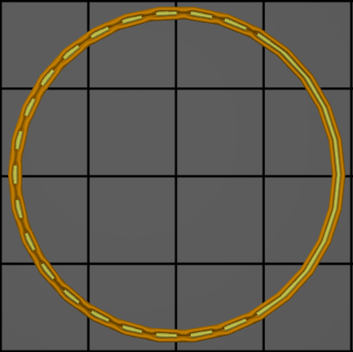
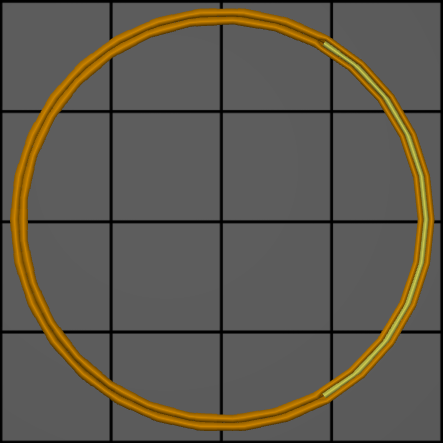

# wall_transition_filter_deviation

* Technologie : FDM
* Groupe : [Réglages de l'Impression](../print_settings/print_settings.md)
* Sous groupe : [Périmètre et enveloppe](../print_settings/print_settings.md#périmètre-et-enveloppe)  - Paramètres Arachne 
* Mode : Expert

## Marge de distance Transition de périmètre

### Description

Certains modèles ont des pièces fines qui oscillent autour du seuil où différents nombres de cordons sont utilisés. Cela peut faire alterner le nombre de cordons dans un sens ou dans l'autre, même si la largeur réelle de la pièce ne varie pas beaucoup. Cette alternance nuit à la qualité de l'impression, nécessitant de nombreux changements de flux et ajoutant plus de déplacements. En utilisant cette fonctionnalité, les transitions sont supprimées si elles auraient alterné.

Lorsqu'une transition est supprimée, certaines lignes peuvent temporairement devenir trop larges ou trop fines. Ce paramètre permet de limiter les transitions qui sont filtrées en limitant la largeur ou la finesse de la ligne.

Pour être précis, les lignes sont autorisées à devenir plus fines que la largeur minimale de la ligne de paroi de cette marge si cela permet d'aller et venir entre différents nombres de murs. De même, les lignes sont autorisées à devenir légèrement plus larges de cette marge, même si un mur supplémentaire de la largeur minimale de ligne de mur aurait pu être intégré.

Ce filtre vise à résoudre un problème courant avec les pièces minces utilisant des maillages 3D de faible résolution. Le modèle 3D, constitué de triangles plats, ne peut pas représenter une courbe de manière exacte mais seulement approximative. La courbe aura des bords, avec des surfaces plates entre eux. Lorsque vous modélisez une pièce courbe de largeur constante, il est important que les bords extérieurs soient alignés avec les bords intérieurs. Si ce n'est pas le cas, la largeur de l'anneau varie légèrement, ce qui peut provoquer l'effet illustré ci-dessus. Si c'est le cas, le filtre de transition devrait empêcher que l'effet soit trop important.

Augmenter la marge permet d'éviter de créer de petits segments de ligne dans certains cas. Cette méthode est plus rapide à imprimer et peut donner un aspect plus lisse à la surface. Cependant, cela permet également de créer des lignes plus larges, qui risquent de ne pas être bien extrudées par votre buse. Lorsque vous imprimez des modèles à faible résolution avec des pièces fines, l'augmentation de la marge peut contribuer à améliorer la qualité. Avec les matériaux difficiles, il est préférable de rester du côté de la sécurité.

Cette marge étend la plage des largeurs d'extrusion qui suivent à [largeur minimale du périmètre - marge, 2 * largeur minimale du périmètre + marge]. L'augmentation de cette marge réduit le nombre de transitions, ce qui réduit le nombre de démarrages/arrêts d'extrusion et le temps de déplacement. Cependant, une grande variation de la largeur de l'extrusion peut entraîner des problèmes de sous-extrusion ou de surextrusion.

Si elle est définie comme pourcentage (par exemple 25%), elle sera calculée sur le diamètre de la buse.

[Retour Liste variables](variable_list.md)