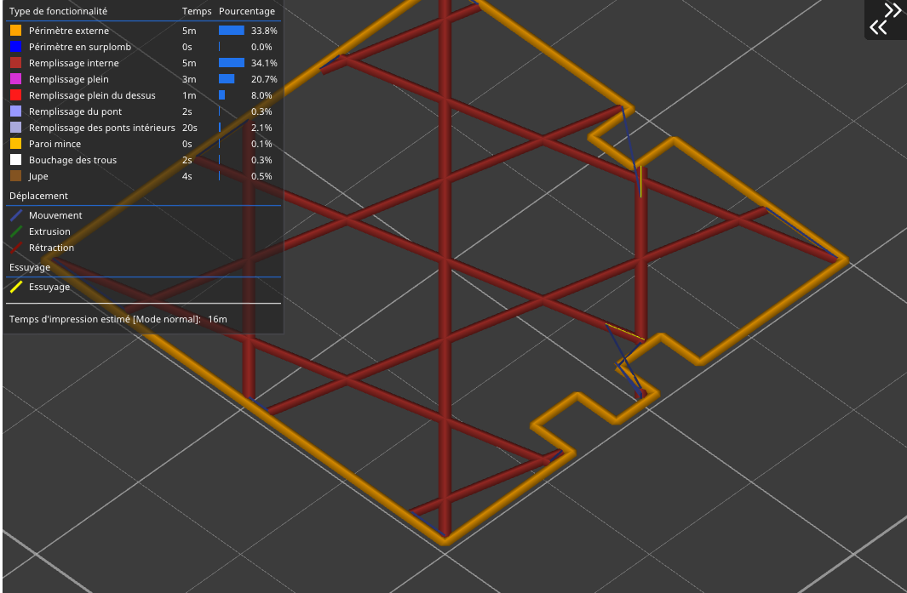
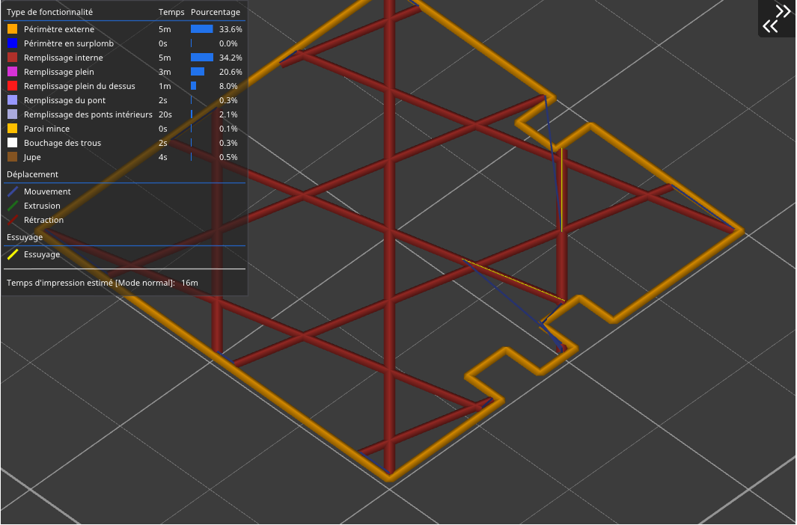

# wipe

* Technologie : FDM
* Groupe : [Réglages de l'Imprimante](../printer_settings/printer_settings.md)
* Sous groupe : [Extrudeuse](../printer_settings/printer_settings.md#extrudeuse) - [Rétraction](../printer_settings/printer_settings.md#rétraction)
* Mode : Avancé

## Essuyer lors des rétractions
    
### Description

Cette option déplace la buse lors des rétractions sur un cordon déjà extrudé, limitant ainsi l'apparition d'amas pour les extrudeuses/matière ayant tendance à suinter. La longueur de l'essuage de la buse est définissable avec le paramètre [Quantité de rétraction avant essuyage](retract_before_wipe.md)

Plus la quantité de rétraction est faible .. plus la longueur d'essuyage sera importante . Exemple Longueur visible avec *70% de quantité de rétraction* avant essuyage :

Longueur visible avec *10% de quantité de rétraction* avant essuyage :

[Retour Liste variables](variable_list.md)
