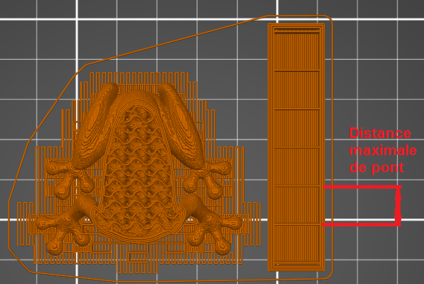

# wipe_tower_bridging

* Technologie : FDM
* Groupe : [Réglages de l'Impression](../print_settings/print_settings.md)
* Sous groupe : Extrudeuses multiples - Tour de purge
* Mode : Avancé

## Distance maximale de pont

### Description

Distance maximales entre les supports épars dans la tour de purge.

* Valeur par défaut : 10 mm

[Retour Liste variables](variable_list.md)