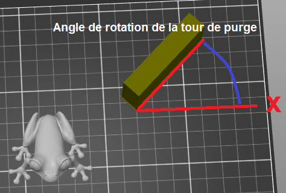

# wipe_tower_rotation_angle

* Technologie : FDM
* Groupe : Réglages de l'Impression
* Sous groupe : Extrudeuses multiples - Tour de purge
* Mode : Avancé

## Angle de rotation de la tour de purge 

### Description

Angle de rotation de la tour de purge par rapport à l'axe X.

[Retour Liste variables](variable_list.md)