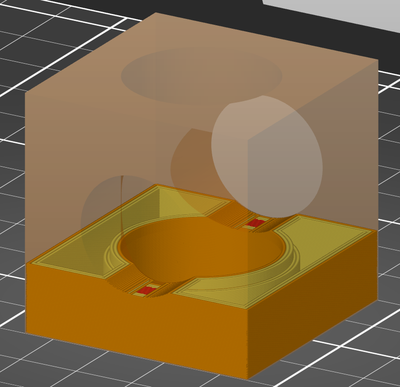

# xy_inner_size_compensation

* Technologie : FDM & SLA
* Groupe : Réglages de l'Impression
* Sous groupe : Modifications des couches
* Mode : Expert

## Compensation en XY intérieur

### Description

L'objet sera agrandi/rétréci dans le plan XY de la valeur configurée (négatif = vers l'intérieur, positif = vers l'extérieur). Cela peut être utile pour régler les dimensions des pièces.

Celui-ci ne s'applique qu'aux parties **internes** de l'objet.

**!!! les trous horizontaux créés des sections ouvertes transformant ces zones en zones extérieures !!!**

[Retour Liste variables](variable_list.md)
